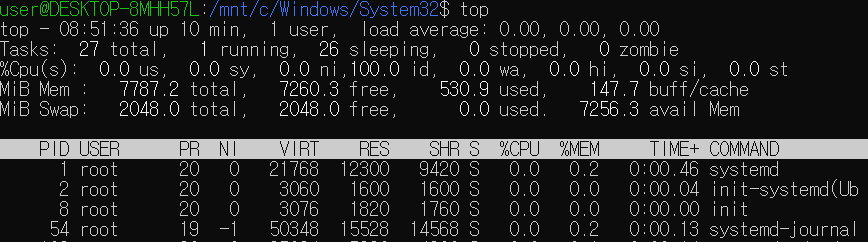
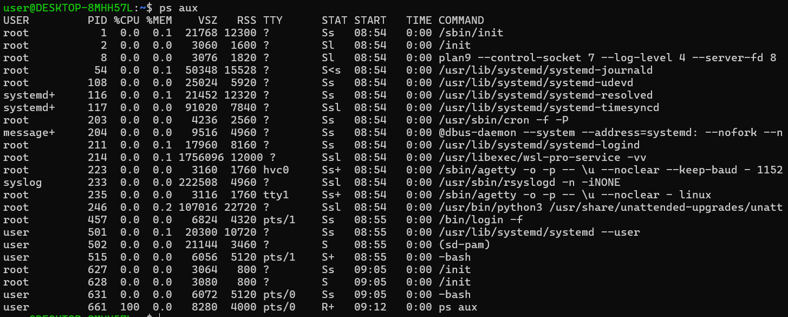
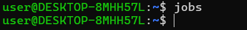
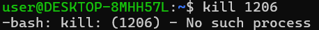

# 오픈소스SW와 파이썬 프로그래밍 리눅스 명령어 조사 과제3
과제에 제시된 top, ps, jobs, kill 을 조사하여 정리하였습니다.

---

## 1. top  

top은 리눅스에서 시스템 자원과 프로세스 상태를 실시간으로 보여준다.  

| 옵션/단축키   | 기능 및 설명                 |
|:-------------|:----------------------------|
| top          | 전체 프로세스/자원 실시간 표시 |
| -u 사용자  | 입력된 사용자만 표시            |
| -p PID(프로세스 ID)     | 특정 프로세스만 추적          |
| P            | CPU 점유율순 정렬(top 실행 중일때)    |
| M            | 메모리 순 정렬(top 실행 중일때)       |
| k            | 프로세스 종료(top 실행 중일때)        |
| q            | top 종료(top 실행 중일때)             |  

예시:  

---

## 2. ps  

ps는 현재 실행 중인 프로세스 정보를 표로 출력한다.  

| 옵션 | 기능 및 설명                |
|:-----|:---------------------------|
| a    | 전체 사용자(현재 로그인된 모든 사람을 말함) 프로세스 표시    |
| u    | 사용자/메모리 등 상세정보 표시 (누가 얼마만큼 쓰나 확인함)    |
| x    | 터미널에 종속되지 않(백그라운드에서 실행 중인) 프로세스까지 포함하여 표시    |
| -e   | 커널 프로세스를 뺀 전체 모든 프로세스 표시              |
| -f   | 풀 포맷으로 표기되어 출력됨                 |

예시:  

---

## 3. jobs  

jobs 명령어는 현재 입력한 셸에서 실행 중이거나 일시정지, 종료된 작업들의 상태를 보여준다.  

| 상태      | 설명        |
|:----------|:-----------|
| Running   | 실행 중이라는 뜻    |
| Stopped   | 일시 정지 상태라는 뜻   |
| Done      | 종료 상태라는 뜻    |

예시:  
$ jobs  
[1]+  Running                 sleep 100 & (100초 대기 명령어)  
[2]-  Stopped                 nano memo.txt (nano로 memo.txt파일을 실행시킴)  
아무 작업도 실행되거나 일시정지 되어있지 않으면 아무것도 출력되지 않는다.  

---

## 4. kill  

kill 명령어는 프로세스 종료(종료, 강제종료, 정지)와 같은 동작을 한다.  

| 옵션  | 설명                        |
|:------|:---------------------------|
| (없음) PID | 종료 신호                    |
| -9 PID   | SIGKILL 즉시 강제 종료      |
| -l PID   | 사용 가능한 신호 목록        |

예시:  
$ kill 1206  
$ kill -9 1206  
$ kill -l  
없는 프로세스를 입력할 경우 이렇게 출력된다.  
  

---

작성자 : 이원겸/20255563  
과제명 : 오픈소스SW와 파이썬 프로그래밍 리눅스 명령어 조사 과제3  

---

### 참고한 사이트  
-https://zzsza.github.io/development/2018/07/18/linux-top/
-https://blog.naver.com/tmk0429/222318530824
-https://gymdev.tistory.com/82
-https://server-talk.tistory.com/432
